### **🤔 사용자들은 부동산 탐색을 위해 어떤 서비스를 사용할까?**

💰 **주택 실거래가** 정보

- 호갱노노

🏠 **부동산 매물** 정보

- 직방

### 💡 만약 **둘을 합친 서비스**가 있다면?

## Project 개집

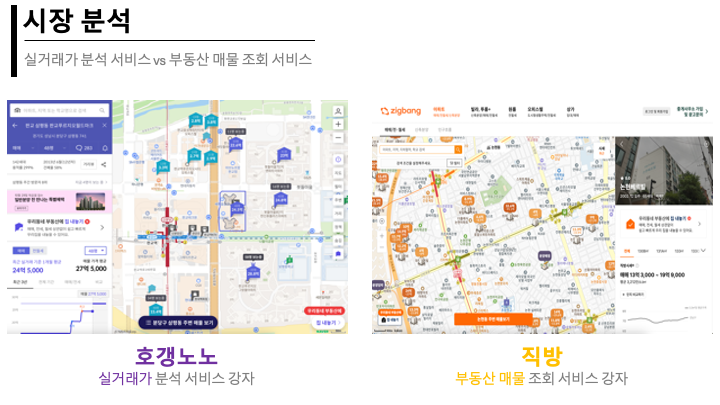

💦 우리는 사용자의 성공적인 내집 마련을 위해 **헌신**합니다.

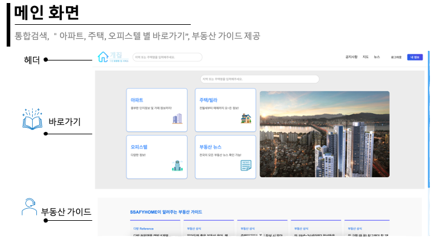

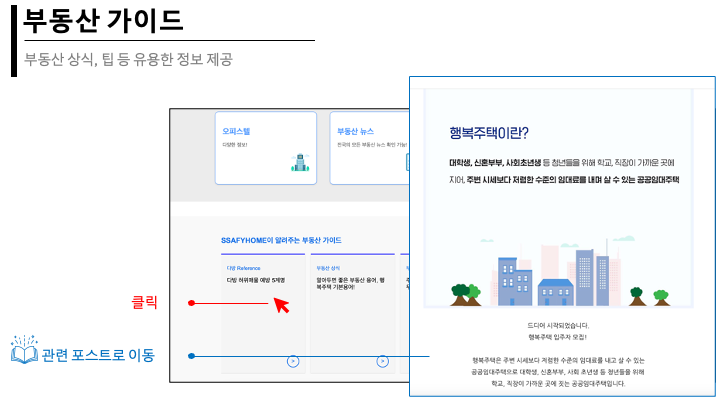

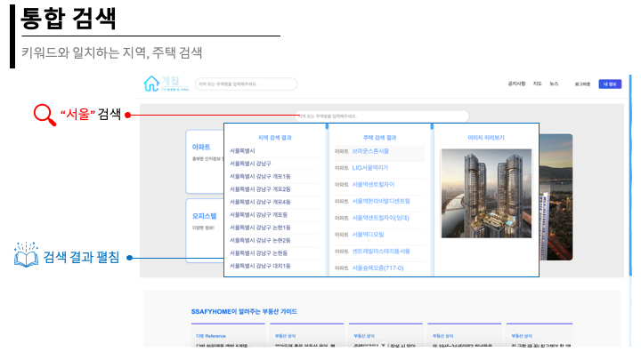

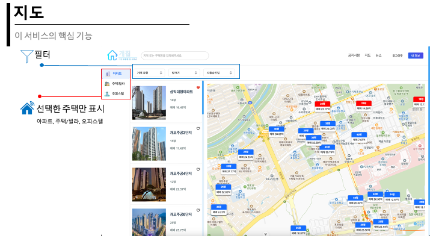

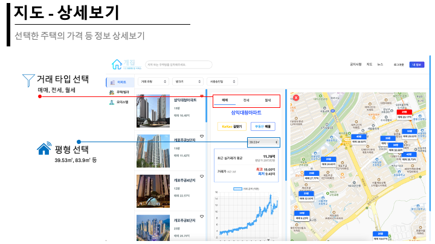

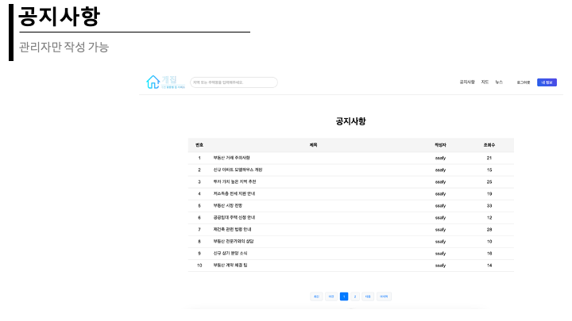

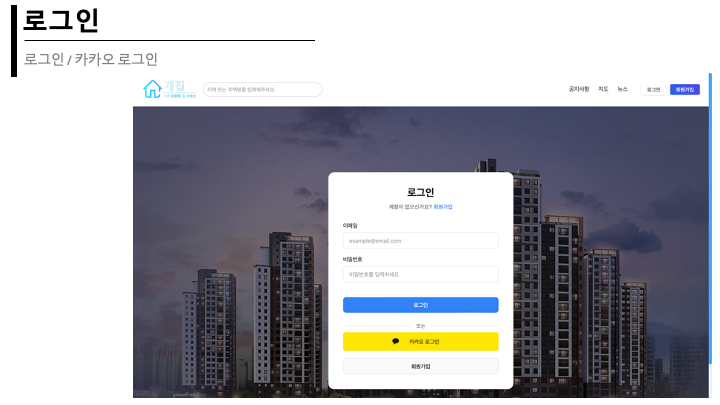

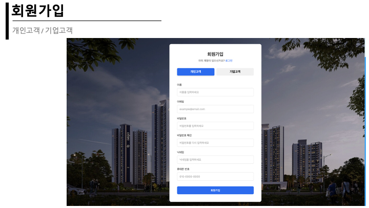

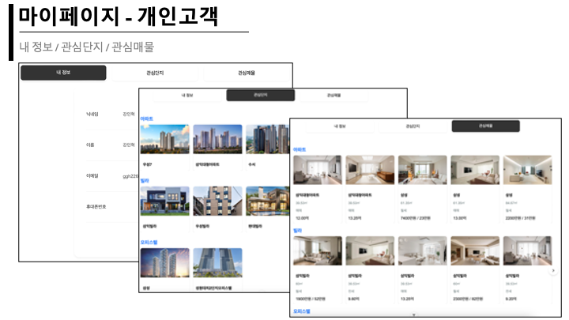

---

### 🌟 Class Diagram

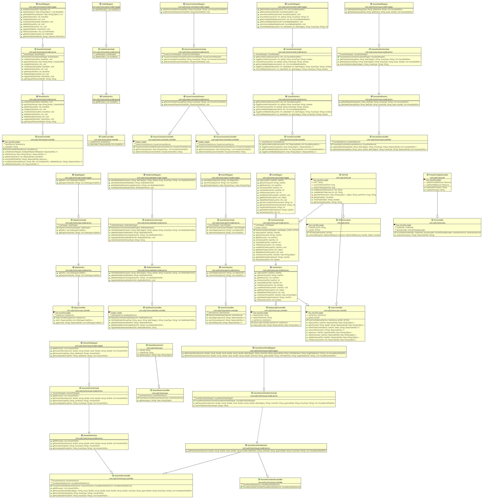

### 🌟 EER Diagram

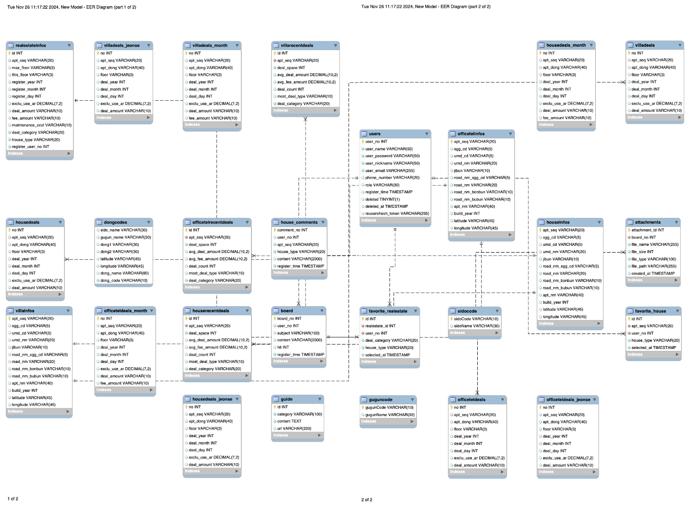

### 🌟 요구사항 정의서

| **요구사항명** | **요구사항 상세** | **우선순위** |
| --- | --- | --- |
| **기능적 요구사항** |  |  |
| 주택 실거래가 정보 수집 | 국토교통부 실거래가 정보 (xlsx) 활용 데이터 가공 후 아파트, 빌라, 오피스텔 별DB 저장 | 필수 |
| 주택 실거래가 검색 | 지도 및 차트를 통해 주택 실거래가 제공 주택별 최근 실거래가, 최고/최저 금액 정보 제공 | 필수 |
| 실거래가 – 주택 카테고리 | 아파트, 오피스텔, 빌라 카테고리별로 분리하여 실거래가 제공 | 추가 |
| 실거래가 – 거래 카테고리 | 매매, 전세, 월세 카테고리 별로 분리하여 실거래가 제공 | 추가 |
| 실거래가 – 기타 카테고리 | 방크기, 주택 연식 별로 분리하여 실거래가 제공 | 추가 |
| 지역/주택 통합검색 | 키워드에 해당하는 지역, 주택정보 통합 검색 헤더 및 메인화면에서 사용 |  |
| 부동산 매물 조회 | 주택별 등록된 부동산 매물 조회 기능 | 필수 |
| 부동산 매물 상세 검색 | 평형 정보, 매매/전세/월세 필터를 통해 매물 정보 제공 | 추가 |
| 관심 주택 정보 관리 | 관심 주택을 설정하여 모아보기 기능, 지도에서의 관심 주택 표시 기능 | 추가 |
| 관심 부동산 매물 관리 | 관심 부동산 매물을 설정하여 모아보기 기능 | 추가 |
| 길찾기 기능 | 주택을 시작점으로, 원하는 검색 포인트까지 길찾기 기능 제공 | 추가 |
| 부동산 뉴스 Open API | 부동산 뉴스를 웹사이트에서 크롤링하여 보여주기 | 심화 |
| 공지사항 관리 | 공지사항 등록, 수정, 삭제, 검색 | 심화 |
| 공지사항 첨부파일 | 첨부파일 등록, 수정, 삭제 기능 | 추가 |
| 회원 관리 | 회원가입, 탈퇴 기능 | 필수 |
| 회원 상세 관리 | 회원 복구 기능 | 추가 |
| 로그인 | 로그인 / 로그아웃 기능 | 필수 |
| 소셜 로그인 | Kakao 소셜 로그인 기능 | 추가 |
| 부동산 가이드 제공 | 부동산 상식, 팁 등 유용한 정보 제공 | 추가 |
| 주택 별 댓글 | 주택 별 실 사용자의 댓글 작성 기능 | 추가 |
| **비 기능적  요구사항** |  |  |
| 공공데이터의 정확성 | 공공 부동산 데이터를 활용하므로, 공공데이터의 정확성이 요구됨 |  |
| 가용성 | 언제나 서비스 가능해야 함 |  |
| 응답성 | 검색에 대한 결과를 빠르게 응답해야 함 |  |
| 사용자 편의성 | 웹 사이트에 대한 사전 지식 없이 쓰기 편해야 함 |  |
